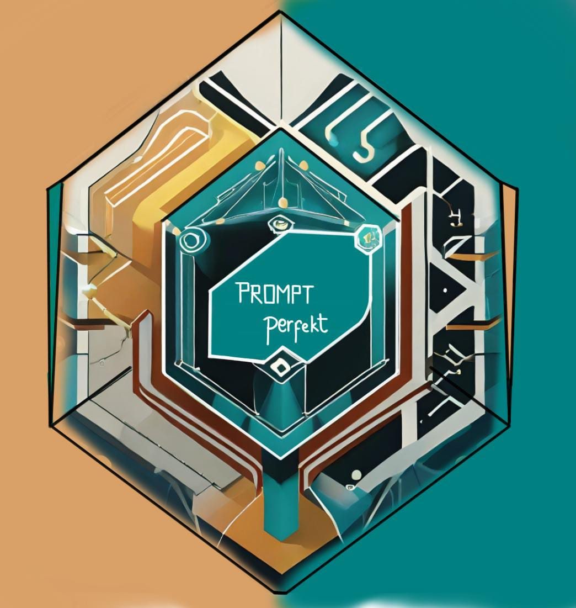

# Prompt_Perfekt

"Prompt_Perfekt stands as the quintessential instrument for refining your prompts, ensuring they align precisely with your envisioned output, and perhaps even surpassing your loftiest expectations."

## 🚀 Overview

Prompt_Perfekt is a comprehensive AI prompt optimization suite built with Streamlit. The application offers multiple AI-powered tools designed to enhance your interaction with various large language models and image generation capabilities.

## ✨ Features

The application includes several powerful modules:

- **Prompt Perfekt**: Optimize your input prompts using advanced prompt engineering techniques to get the best possible output quality from AI models
- **Chat with Images**: Interact with AI using both text and images (multimodal capabilities)
- **Web Assistant**: AI-powered web browsing and information retrieval
- **Chat-Bot**: Conversational AI interface for natural language interactions
- **Image Generator**: Create images from text descriptions

## 🛠️ Technologies Used

- **Streamlit**: For the interactive web application interface
- **LangChain**: Framework for developing applications powered by language models
- **OpenAI**: Integration with OpenAI's language models
- **Google Generative AI**: Integration with Google's Gemini models
- **FAISS**: For efficient similarity search and clustering of dense vectors
- **BeautifulSoup**: For web scraping capabilities

## 🚀 Getting Started

### Prerequisites

- Python 3.8 or higher
- Required Python packages (see requirements.txt)

### Installation

1. Clone the repository:
```bash
git clone https://github.com/Nipurn123/Prompt_Perfekt.git
cd Prompt_Perfekt
```

2. Install the required packages:
```bash
pip install -r requirements.txt
```

3. Run the application:
```bash
streamlit run MainStreamlit_App.py
```

## 📋 Usage

1. Launch the application using the command above
2. Use the sidebar to select the desired tool:
   - Prompt Perfekt
   - Chat with Images
   - Web Assistant
   - Chat-Bot
   - Image Generator
3. Follow the on-screen instructions for each tool

## 🔑 API Keys

Some features require API keys:
- For OpenAI models (optional configuration available)
- For Google Gemini models (requires API key input)

## 🤝 Contributing

Contributions, issues, and feature requests are welcome!

## 📝 License

This project is available under the MIT License.